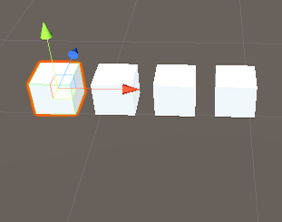
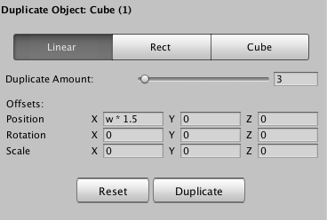
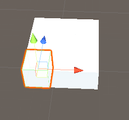
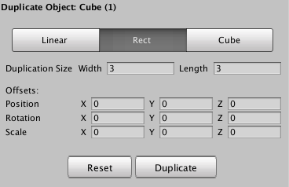
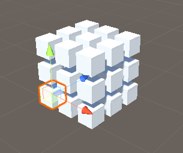
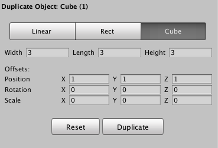

# Unity Advanced Duplicator

Easy to use duplicator for any type of game object within Unity, allows for adding offsets using formulas such as (w - n * 3) which would just be the width of the object - the current duplicate number * 3

## Features

### Linear Duplication
Basically just duplication on 1 axis  
Duplicate Amount: Number of dupes.. duh?

Offset variables:
| Var Name | Description |
| -------- | ----------- |
| N | Current dupe index |
| W | Width of object |
| H | Height of object |

 

### Rect Duplication
Duplication on X and Z

Width: # of dupes on X axis  
Length: # of dupes on Z axis

Offset variables:
| Var Name | Description |
| -------- | ----------- |
| W | Width of object |
| H | Height of object |

 
### Cube Duplication
Duplication on... you guessed it, X, Y and Z

Width: # of dupes on X axis  
Length: # of dupes on Z axis  
Height: # of dupes on Y axis

Offset variables:
| Var Name | Description |
| -------- | ----------- |
| W | Width of object |
| H | Height of object |

 

### Offsets

3 Vector3 inputs for position, rotation and scale. Each of these inputs has different variables that can be inserted into an expression to be evaluated for each dupe.

Examples:

3.404 * 2 : valid  
{varName} + 2 * (2 - 5) : valid  
34^{varName} - 4 : valid  

Note: Some of this code needs to be refactored after a couple of features were pushed out pretty fast